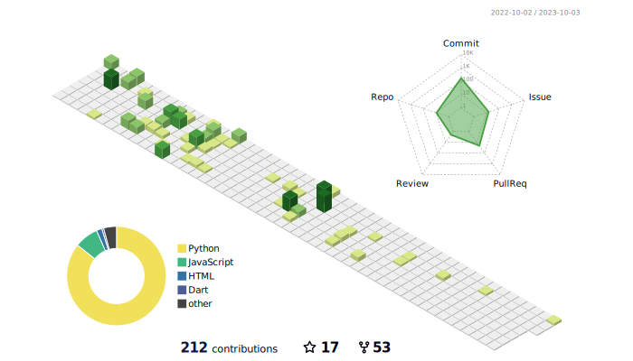

<h2 align="left">Hi 👋, I'm Lutfunnahar Lota</h2>
<h4 align="left">I'm a 🚀 passionate Software Engineer 🚀, I ❤️ to work on new technologhy ❤️</h4>
 
<!-- 
  
 -->

<h4 align="left">Connect with me:</h4>

	
  

<h4 align="left">Languages and Tools:</h4>

      

<h4><i>GitHub's Stats </i></h4>

<h4 align="left"> 🐍 A Snake Eating my Contributions Graph</h4>
	

	 

<!--  -->

<!--
**lota-lutfunnahar/lota-lutfunnahar** is a ✨ _special_ ✨ repository because its `README.md` (this file) appears on your GitHub profile.

Here are some ideas to get you started:

- 🔭 I’m currently working on ...
- 🌱 I’m currently learning ...
- 👯 I’m looking to collaborate on ...
- 🤔 I’m looking for help with ...
- 💬 Ask me about ...
- 📫 How to reach me: ...
- 😄 Pronouns: ...
- ⚡ Fun fact: ...
-->
